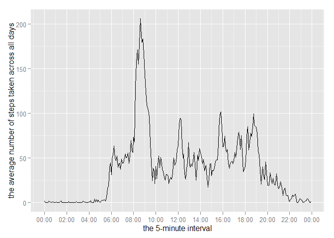
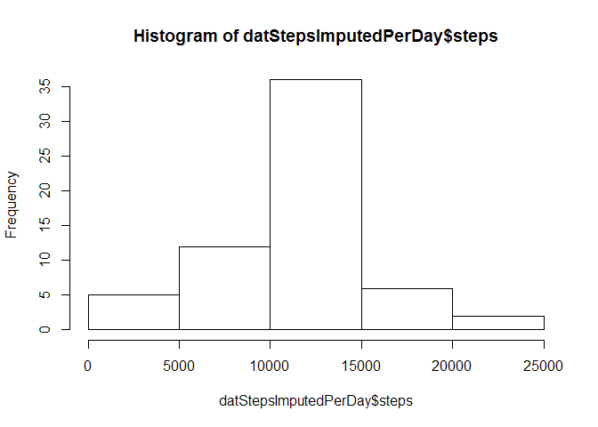
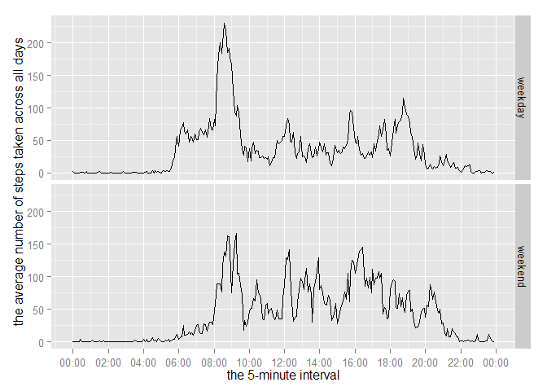

# Reproducible Research: Peer Assessment 1


## Loading and preprocessing the data


```r
Sys.setlocale(category = "LC_ALL", locale = "C")
```

```
## [1] "C"
```

```r
datRaw <- read.csv("activity.csv", stringsAsFactors = FALSE)

datStepsPerInterval <- aggregate(steps ~ interval, data=datRaw, mean, na.rm=TRUE)
```

## What is mean total number of steps taken per day?

- Make a histogram of the total number of steps taken each day

```r
datStepsPerDay <- aggregate(steps ~ date, data=datRaw, sum, na.rm=TRUE)
hist(datStepsPerDay$steps)
```

 

- Calculate and report the mean and median total number of steps taken per day

```r
StepsMean <- mean(datStepsPerDay$steps)
StepsMedian <- median(datStepsPerDay$steps)
```
The mean total number of steps taken per day is **1.0766189\times 10^{4}**.

The median total number of steps taken per day is **10765**.

## What is the average daily activity pattern?

-Make a time series plot (i.e. type = "l") of the 5-minute interval (x-axis) and the average number of steps taken, averaged across all days (y-axis)

```r
#datStepsPerInterval <- aggregate(steps ~ interval, data=datRaw, mean, na.rm=TRUE)
library(stringr)
```

```
## Warning: package 'stringr' was built under R version 3.1.2
```

```r
datStepsPerInterval$time <- paste("2015-01-01", str_pad(datStepsPerInterval$interval, 4, pad = "0"))
library(lubridate)
```

```
## Warning: package 'lubridate' was built under R version 3.1.2
```

```r
datStepsPerInterval$time <- parse_date_time(datStepsPerInterval$time,"%Y%m%d %H%M")
library(ggplot2)
```

```
## Warning: package 'ggplot2' was built under R version 3.1.2
```

```r
library(scales)
```

```
## Warning: package 'scales' was built under R version 3.1.2
```

```r
qplot <- qplot(time, steps, data=datStepsPerInterval, geom="line") 
qplot <- qplot + scale_x_datetime(labels=date_format("%H:%M"),breaks="2 hours") 
qplot <- qplot + labs(x = "the 5-minute interval", y="the average number of steps taken across all days")
qplot
```

 

-Which 5-minute interval, on average across all the days in the dataset, contains the maximum number of steps?

```r
max <- datStepsPerInterval[which.max(datStepsPerInterval$steps),"interval"]
```
The interval **835** , on average across all the days in the dataset, contains the maximum number of steps.

## Imputing missing values

1. Calculate and report the total number of missing values in the dataset (i.e. the total number of rows with NAs)


```r
Count_NA <- nrow(datRaw[is.na(datRaw$steps),])
```

The total number of the missing values in the dataset is **2304**.

2. Devise a strategy for filling in all of the missing values in the dataset. The strategy does not need to be sophisticated. For example, you could use the mean/median for that day, or the mean for that 5-minute interval, etc.

I will fill in all of the missing values by using **the mean for that 5-minute interval** 

3. Create a new dataset that is equal to the original dataset but with the missing data filled in.


```r
library(plyr)
```

```
## Warning: package 'plyr' was built under R version 3.1.2
```

```
## 
## Attaching package: 'plyr'
## 
## The following object is masked from 'package:lubridate':
## 
##     here
```

```r
names(datStepsPerInterval)[2] <- "steps_mean"
datImput <- join(datRaw, datStepsPerInterval, by="interval", type="left")
datImput$steps[is.na(datImput$steps)] <- datImput$steps_mean[is.na(datImput$steps)]
datImput <- datImput[,c("steps","date","interval")]
```

4. Make a histogram of the total number of steps taken each day and Calculate and report the mean and median total number of steps taken per day. Do these values differ from the estimates from the first part of the assignment? What is the impact of imputing missing data on the estimates of the total daily number of steps?


```r
datStepsImputedPerDay <- aggregate(steps ~ date, data=datImput, sum, na.rm=TRUE)
hist(datStepsImputedPerDay$steps)
```

 

```r
meanImputed <- mean(datStepsImputedPerDay$steps)
medianImputed <- median(datStepsImputedPerDay$steps)
```
The mean_imputed total number of steps taken per day is **1.0766189\times 10^{4}**.

The median_imputed total number of steps taken per day is **1.0766189\times 10^{4}**.

The mean (1.0766189\times 10^{4}) is the same as the mean_imputed (1.0766189\times 10^{4}).

The median (10765) differ from the median_imputed (1.0766189\times 10^{4})

The impact of imputing missing data is the median being changed.

## Are there differences in activity patterns between weekdays and weekends?
1. Create a new factor variable in the dataset with two levels – “weekday” and “weekend” indicating whether a given date is a weekday or weekend day.


```r
fWeek <- factor(c("weekday","weekend"))
```

2. Make a panel plot containing a time series plot (i.e. type = "l") of the 5-minute interval (x-axis) and the average number of steps taken, averaged across all weekday days or weekend days (y-axis). 


```r
datImput$week <- ifelse(weekdays(as.Date(datImput$date)) %in% c("Saturday","Sunday"), "weekend","weekday")
datImputMeanPerInterval <- aggregate(steps ~ interval + week, data=datImput, mean)
datImputMeanPerInterval$time <- paste("2015-01-01", str_pad(datImputMeanPerInterval$interval, 4, pad = "0"))
datImputMeanPerInterval$time <- parse_date_time(datImputMeanPerInterval$time,"%Y%m%d %H%M")
qplotWeek <- qplot(time, steps, data=datImputMeanPerInterval, geom="line")
qplotWeek <- qplotWeek + scale_x_datetime(labels=date_format("%H:%M"),breaks="2 hours")
qplotWeek <- qplotWeek + labs(x = "the 5-minute interval", y="the average number of steps taken across all days")
qplotWeek + facet_grid(week ~ .)
```

 
